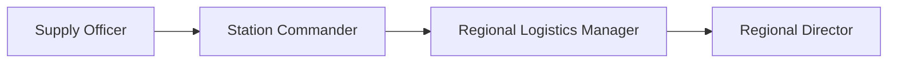
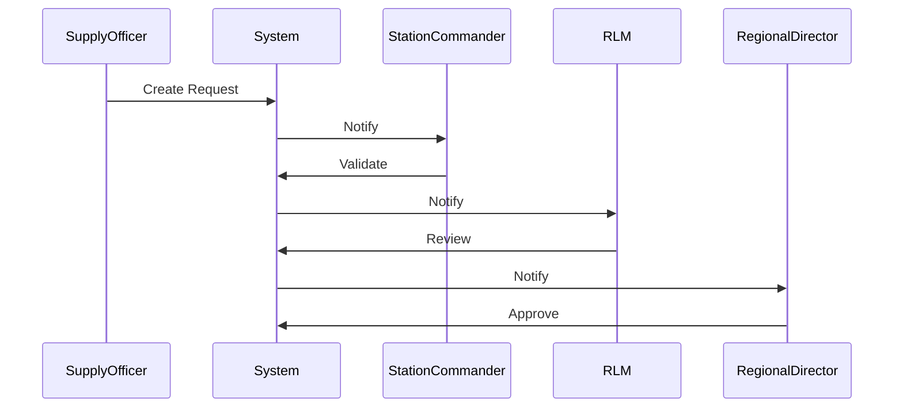

# 📘 Product Requirements Document (PRD)
## BFP Regional Logistics Management System (Single Region)

---

## 1. Product Overview

### 1.1 Product Name
**BFP Regional Logistics Management System (BRLMS)**

### 1.2 Purpose
The BRLMS is a **government-grade web and mobile system** designed to manage logistics, supplies, assets, and approval workflows of the **Bureau of Fire Protection (BFP)** within **one region only**. The system digitizes and standardizes logistics operations while respecting actual BFP chain-of-command and operational autonomy of fire stations.

### 1.3 Target Users
- Fire Stations (Supply Officers, Station Commanders)
- Provincial Logistics Offices
- Regional Office (Director, Admin)

### 1.4 Goals
- Eliminate manual paper-based logistics workflows
- Enforce correct BFP approval hierarchy
- Enable real-time visibility of logistics status
- Ensure auditability, security, and compliance

---

## 2. Scope Definition

### 2.1 In Scope
- Logistics request creation and tracking
- Asset and inventory management
- Approval workflows (Station → Province → Region)
- Notifications and alerts
- Audit logs and reporting
- Web (Next.js) and Mobile (Expo) access

### 2.2 Out of Scope
- Cross-region operations
- City / Municipal Fire Marshal approvals
- Procurement bidding systems
- HR and payroll modules

---

## 3. Organizational Hierarchy (Fixed)

```
Region
 └── Province
      └── City / Municipality
           └── Fire Station (Autonomous)
```

> Each Fire Station handles its own logistics internally and independently.

---

## 4. Roles & Permissions

### 4.1 Roles

#### Station Level
- **Supply Officer**
- **Station Commander**

#### Regional Level
- **Regional Logistics Manager (RLM)**
- **Regional Director**
- **Regional System Administrator**

---

## 5. Functional Requirements

### 5.1 Logistics Request Management

#### FR-01 Create Request
- Supply Officer can create a request
- Required fields:
  - Item category
  - Quantity
  - Justification
  - Priority
  - Supporting documents

#### FR-02 Station Validation
- Station Commander validates requests
- Can approve (forward) or reject with remarks

#### FR-03 Regional Logistics Review
- RLM reviews all station requests
- Can consolidate, split, reprioritize
- Cannot finalize approval

#### FR-04 Regional Approval
- Regional Director performs final approval or rejection
- Can issue emergency override approvals

---

## 5.2 Inventory Management

#### FR-05 Station Inventory Visibility
- **Station Commander**: Can view full inventory list of their own station.
- **Supply Officer**: Can view and manage (add/edit) inventory of their own station.

#### FR-06 Regional Inventory Visibility
- **Regional Logistics Manager (RLM)**: Can view inventory of **ALL** stations in the region.
- **Regional Director**: Can view inventory of **ALL** stations in the region.

---

## 6. Approval Workflow (Final)

```
Supply Officer
   ↓
Station Commander (Validation)
   ↓
Regional Logistics Manager (Logistics Review)
   ↓
Regional Director (Final Approval)
```

🚫 City Fire Marshal – Not involved
🚫 Provincial Fire Marshal – Not involved

---

## 7. Swimlane Diagram (Textual)

| Role | Action |
|-----|-------|
| Supply Officer | Create request, upload documents |
| Station Commander | Validate or reject |
| PLM | Consolidate and prioritize |
| Regional Director | Approve or reject |

---

## 8. User Stories & Acceptance Criteria

### Supply Officer
- As a Supply Officer, I can submit logistics requests so that my station remains operational.
- **Acceptance:** Cannot submit without justification and attachments.

### Station Commander
- As a Station Commander, I can validate station requests.
- **Acceptance:** Cannot view other stations.

### Regional Logistics Manager
- As a RLM, I can see all station requests.
- **Acceptance:** Cannot approve final requests.

### Regional Director
- As a Director, I can approve or reject requests.
- **Acceptance:** Approval triggers audit log and notifications.
- As a Director, I can view inventory levels across all stations to make informed approval decisions.

### Inventory Visibility
- **Station Commander**: "I can see my station's current stock to validate if a request is truly needed."
- **RLM**: "I can see stock levels of all stations to identify surplus or shortages before approving procurement."

---

## 9. Permission Matrix

| Role | Create Request | Validate Request | Consolidate Request | Approve Request | View Own Inventory | View All Inventory |
|------|----------------|------------------|---------------------|-----------------|--------------------|--------------------|
| Supply Officer | ✅ | ❌ | ❌ | ❌ | ✅ | ❌ |
| Station Commander | ❌ | ✅ | ❌ | ❌ | ✅ | ❌ |
| RLM | ❌ | ❌ | ✅ | ❌ | ✅ (n/a) | ✅ |
| Regional Director | ❌ | ❌ | ❌ | ✅ | ✅ (n/a) | ✅ |

---

## 10. Non-Functional Requirements

### 10.1 Security
- Role-based access control
- No self-registration
- Password complexity enforcement
- Optional 2FA for Regional roles

### 10.2 Performance
- API response < 300ms (average)
- Supports concurrent station requests

### 10.3 Availability
- 99.5% uptime

---

## 11. System Architecture

### 11.1 Technology Stack
- **Web:** Next.js + shadcn/ui
- **Mobile:** Expo
- **API:** ORPC
- **Auth:** BetterAuth
- **Database:** Supabase PostgreSQL
- **ORM:** Drizzle
- **Storage:** Supabase Storage
- **Notifications:** Firebase Cloud Messaging
- **Hosting:** Vercel

---

## 12. Data Model (High-Level)

- users
- roles
- regions
- provinces
- cities
- stations
- requests
- request_items
- approvals
- audit_logs

---

## 13. Account & Identity Management

- Accounts created only by Regional System Admin
- Users mapped strictly to one organizational unit
- Forced password reset on first login

---

## 14. Audit & Compliance

- Immutable audit logs
- Timestamped approvals
- User and role traceability

---

## 15. Deployment & Environment

- Hosted on Vercel
- Supabase for managed services
- Environment-based access controls

---

## 16. Success Metrics

- Reduction in request processing time
- Zero unauthorized approvals
- Full traceability in audits

---

## 17. Risks & Mitigation

| Risk | Mitigation |
|----|----|
| Misuse of approvals | Strict RBAC |
| Downtime | Managed hosting |
| Data loss | Daily backups |

---

## 18. Implementation Reference

Refer to **Dev Task JSON** for execution tracking.

---

✅ This PRD represents the FINAL, DETAILED, and IMPLEMENTATION-READY specification for the BFP Regional Logistics Management System.


# 🚀 DEVELOPMENT ARTIFACTS (IMPLEMENTATION READY)

---

## A. ORPC API CONTRACT (CORE)

### Authentication
- auth.login
- auth.logout
- auth.changePassword
- auth.forgotPassword
- auth.resetPassword

### Requests
- request.create (Supply Officer)
- request.updateDraft (Supply Officer)
- request.submit (Supply Officer)
- request.validate (Station Commander)
- request.reject (Station Commander)
- request.regionReview (RLM)
- request.consolidate (RLM)
- request.finalApprove (Regional Director)
- request.finalReject (Regional Director)

### Inventory & Assets
- inventory.listByStation
- inventory.adjust
- asset.create
- asset.updateStatus
- asset.transfer

### Admin
- admin.createUser
- admin.disableUser
- admin.assignRole

---

## B. RBAC MIDDLEWARE RULES

| ORPC Procedure | Supply Officer | Station Cmdr | RLM | Regional Dir |
|--------------|--------------|--------------|-----|--------------|
| request.create | ✅ | ❌ | ❌ | ❌ |
| request.validate | ❌ | ✅ | ❌ | ❌ |
| request.consolidate | ❌ | ❌ | ✅ | ❌ |
| request.finalApprove | ❌ | ❌ | ❌ | ✅ |
| admin.createUser | ❌ | ❌ | ❌ | ✅ |

RBAC enforced via ORPC middleware + BetterAuth session.

---

## C. DATABASE ERD (TEXTUAL)

### users
- id (PK)
- email
- password_hash
- role_id
- station_id
- province_id
- is_active

### roles
- id (PK)
- name

### provinces
- id (PK)
- name

### stations
- id (PK)
- name
- province_id

### requests
- id (PK)
- station_id
- status
- priority
- created_by
- validated_by
- approved_by

### request_items
- id (PK)
- request_id
- item_name
- quantity

### approvals
- id (PK)
- request_id
- role
- action
- remarks

### audit_logs
- id (PK)
- user_id
- action
- entity
- timestamp

---

## D. SWIMLANE (MERMAID)



---

## E. SEQUENCE DIAGRAM (MERMAID)



---

## F. TEST CASES (CORE)

### TC-01 Create Request
- Given Supply Officer logged in
- When submitting request
- Then status = DRAFT

### TC-02 Validate Request
- Given Station Commander
- When validates
- Then status = VALIDATED

### TC-03 Unauthorized Approval
- Given RLM
- When tries final approve
- Then ACCESS DENIED

---

## G. DEPLOYMENT CHECKLIST

- [ ] Supabase project created
- [ ] Postgres schema migrated (Drizzle)
- [ ] BetterAuth configured
- [ ] ORPC endpoints deployed
- [ ] FCM keys configured
- [ ] Supabase Storage buckets created
- [ ] Vercel environment variables set
- [ ] Admin account seeded

---

## H. UI PAGE MAP

- /login
- /dashboard
- /requests
- /requests/:id
- /inventory
- /assets
- /admin/users

---

## I. SECURITY CONTROLS

- Forced password reset on first login
- Optional 2FA for Regional roles
- Session timeout
- Full audit logging

---

✅ SYSTEM IS NOW FULLY SPECIFIED FOR DEVELOPMENT

